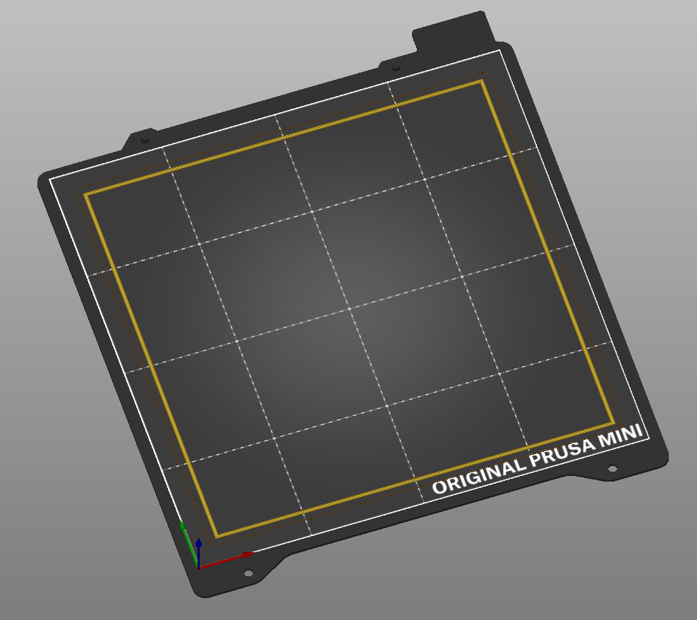
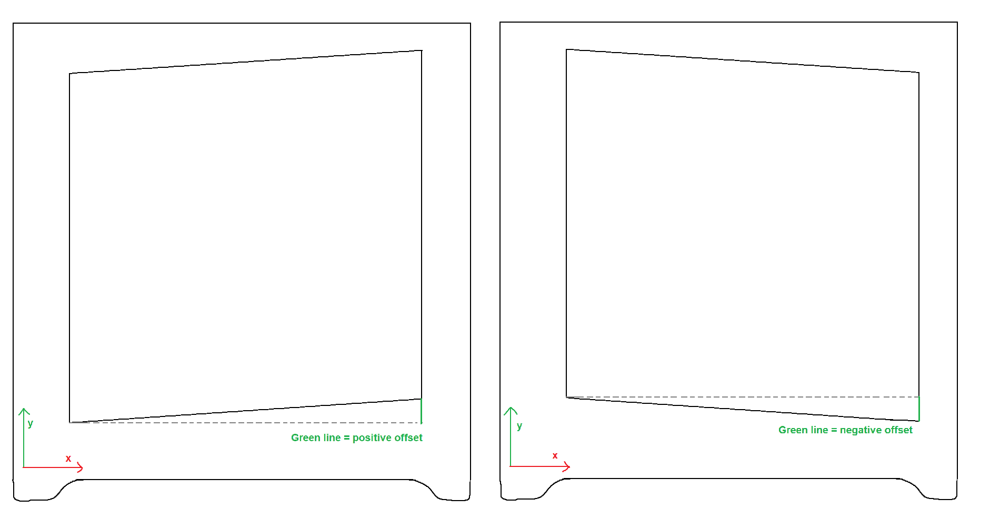

# 3D-Printer-XY-Skew-Correction
Correct the skew between X and Y axis on a 3D printer

Inspiration from https://github.com/MechanizedMedic/gskewer but the XY skew correction there did not seem correct

Made for Prusa Mini but would work with any printer. Cantilever printer designs are most susceptible to XY skew.

No set square or long prints required, just a ~3 minute 1 layer print and a sheet of paper.

Steps:

1. Print `160mm square.stl` (or resize for your print bed). Do not remove from the bed. 

2. Align a sheet of paper with the origin corner of the print, and align the edge of the paper with the inside edge of the Y axis side of the print. It is easier to handle if you cut the paper to be slightly larger than the print, just make sure to mark the original corner (you won't cut a perfect 90 degree corner)

3. At the far X end, there will be an offset to the print. This will either cover up part of the print, or reveal a gap between the paper and print. E.g. covering up the print:

E.g. revealing a gap:

4. Measure this offset. It is easier to measure an offset where there is a gap, if your covers it up, rotate 90 degrees and measure this offset, it will be the reverse but the same distance (i.e. showing a gap the same size as what was covered before). 

5. Edit `skew.py` for your offset. Also a diagram in the script to show how your offset should be

Run the script with an argument for the gcode file location. This will create a new file ending in -fix-skew.gcode

`python skew.py some_gcode_file.gcode`
